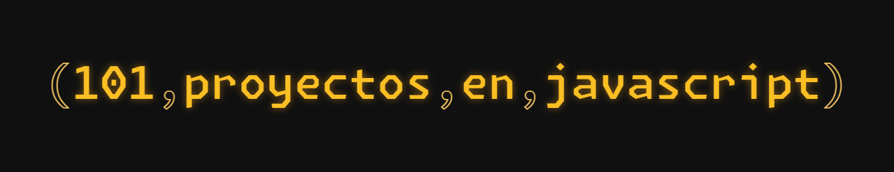

# 101 Proyectos JS

{ 101 Proyectos JS } es una página web creada con Astro donde encontrarás una colección de 101 proyectos desarrollados exclusivamente con JavaScript vanilla, sin el uso de ninguna biblioteca adicional. Cada proyecto está disponible como código abierto bajo la Licencia MIT.

## Características 🚀

- Colección de 101 proyectos de JavaScript puro.
- Desarrollado con tecnologías web estándar: HTML, CSS y JavaScript.
- Cada proyecto es independiente y está disponible como código abierto.

## Instalación 🛠️

Para utilizar { 101 Proyectos JS } localmente, sigue estos pasos:
1. Clona el repositorio desde [GitHub](https://github.com/CrashLanXD/101-proyectos-javascript).
2. Abre una terminal y navega hasta el directorio del repositorio clonado.
3. Instala las dependencias: `pnpm install`
4. Inicia  el servidor de desarrollo: `pnpm run dev`

## Estado del Proyecto 🌐

## Contribución

Si deseas realizar mejoras en los proyectos existentes, sigue estas instrucciones:
1. Haz un fork del repositorio.
2. Crea una nueva rama para tu contribución.
3. Realiza los cambios y asegúrate de seguir las pautas de contribución.
4. Envía un pull request con tus cambios.

## Licencia

Todos los proyectos en { 101 Proyectos JS } están disponibles bajo la Licencia MIT. Para obtener más detalles, consulta el archivo [LICENSE](https://github.com/CrashLanXD/101-proyectos-javascript/blob/master/LICENSE).

## Contribuidores 

## Contacto 📬

Si tienes preguntas, comentarios o sugerencias, no dudes en ponerte en contacto:
- Correo electrónico: [crashlanxd@gmail.com](mailto:crashlanxd@gmail.com)
- X / Twitter: [@crashlanxd](https://x.com/crashlanxd)
