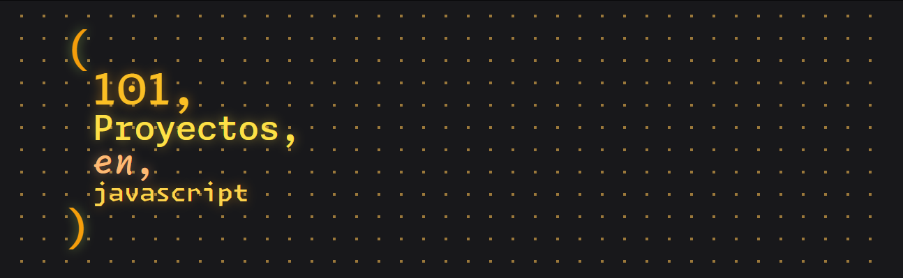

  
  <h3>
    <strong>101 proyectos de JavaScript con código</strong>
  </h3>

  <a href="https://javascript101clxd.netlify.app">
    Website
  </a>

## :fire: Proyectos

| #   | Proyecto                         | Descripción                                                                                                           | Código                                                                                                                                                                                                                        | Website                                                                                                                                                                              |
| --- | -------------------------------- | --------------------------------------------------------------------------------------------------------------------- | ----------------------------------------------------------------------------------------------------------------------------------------------------------------------------------------------------------------------------- | ------------------------------------------------------------------------------------------------------------------------------------------------------------------------------------ |
| 1   | **Falling-Sand**                 | Una simulación de Arena que cae y se acumula en una cuadrícula                                                        |                  |                  |
| 2   | **Elementary-Cellular-Automata** | Cada celda evoluciona según reglas simples basadas en el estado de sus vecinos.                                       |  |  |
| 3   | **The-Game-Of-Life**             | El famoso juego de simulación de vida de John Conway                                                                  |                  |                  |
| 4   | **Breakout**                     | Juego mítico y clásico, Breakout del Atari para controlar con teclado                                                 |                      |                      |
| 5   | **Space-Invaders**               | El más emocionante juego de arcade de todos los tiempos ¡Compite contra los invasores alienígenas con tu cañón láser! |                |                |

  
  
  

## 👑 Contribuidores 👑

